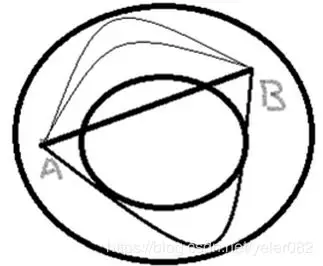

# 计算机视觉当中的几个基本概念

> 来源：CSDN，作者：yeler082

> 原文：https://blog.csdn.net/yeler082/article/details/85562797

## 1. 图像分割

从图像中将某个特定区域与其他部分进行分离并提取出来的处理就是图像分割。因为图像分割处理实际上就是区分图像中的“前景目标”和“背景”，所以通常又称之为图像的二值化处理。图像分割在图像分析、图像识别、图像检测等方面占有非常重要的低位。

在计算机视觉领域，图像分割（Segmentation）指的是将数字图像细分为多个图像子区域（像素的集合）（也被称作超像素）的过程。图像分割的目的是简化或改变图像的表示形式，使得图像更容易理解和分析。图像分割通常用于定位图像中的物体和边界（线，曲线等）。

更精确的，图像分割是对图像中的每个像素加标签的一个过程，这一过程使得具有相同标签的像素具有某种共同视觉特性。图像分割的结果是图像上子区域的集合（这些子区域的全体覆盖了整个图像），或是从图像中提取的轮廓线的集合（例如边缘检测）。一个子区域中的每个像素在某种特性的度量下或是由计算得出的特性都是相似的，例如颜色、亮度、纹理。邻接区域在某种特性的度量下有很大的不同。

在图像分割的处理中，其实可以将图像视作是由像素组成的有序集合，而图像分割就是将此集合按照某种规则划分出若干子集的过程。

图像分割的方法依照分割时所依据的图像特征不同，大致可以分为三大类：

* 阈值方法：这种方法是根据图像的灰度值分布特性来确定某个阈值来进行图像分割；

* 边界分割法：这种方法是通过检测出封闭某个区域的边界来进行图像分割的。通俗的讲，这类方法实际上就是沿着闭合的边缘线将其包围的区域剪切出来；

* 区域提取方法：这类方法的特点是根据特定区域与其他背景区域特性上的不同来进行图像分割。

## 2. 欧氏距离( Euclidean Distance)

通常我们总是习惯在相应的起点和终点之间用直线段相连, 并求取相应的直线距离, 即欧氏距离。

但是, 这种方法并非对所有的情况都有效, 当两点间的直线段有一部分不落在所考虑的区域之内时(如小船在湖泊中航行的例子), 欧氏距离对所讨论的问题实际上是没有意义的, 这就是欧距离在 空间分析过程中的局限性。其原因在于定义区域中两点间的距离时, 没有考虑到区域的连通性, 只考虑了起点和终点间的抽象距离。

## 3. 测地距离(Geodesic Distance)

测地距离是数学形态学中的一个重要概念，主要用于流域分割（流域又称集水区域，是指流经其中的水流和其它物质从一个公共的出水口排出从而形 成一个集中的排水区域）。

如下图一连通图形所示，A、B是其中两点，按通常欧式距离（ Euclidean distance）也称欧几里得距离，它是一个通常采用的距离定义，它是在m维空间中两个点之间的真实距离）的定义，A、B间的距离应为直线段AB的长度，但是有时线段AB的一部分可能会不包括在连通图形X内，如在下图中线段AB就有一段没有包含在连通的图形中，因此这种距离有其不合理的一面。现用如下方法重新定义A、B之间的距离：由于下图是连通的，故在所给图一的连通图形中至少有一条线路可以连接A、B两点，如下图一所示，所有这些线中最短的一条称为A、B间的测地弧。测地弧的长度称为A、B间的测地距离，记为D(A-B)。

 

## 4. SIFT特征

SIFT（Scale-invariant feature transform）：尺度不变特征变换，是用于图像处理领域的一种描述。这种描述具有尺度不变性，可在图像中检测出关键点，是一种局部特征描述子。

SIFT特征是基于物体上的一些局部外观的兴趣点而与影像的大小和旋转无关。对于光线、噪声、微视角改变的容忍度也相当高。基于这些特性，它们是高度显著而且相对容易撷取，在母数庞大的特征数据库中，很容易辨识物体而且鲜有误认。使用SIFT特征描述对于部分物体遮蔽的侦测率也相当高，甚至只需要3个以上的SIFT物体特征就足以计算出位置与方位。在现今的电脑硬件速度下和小型的特征数据库条件下，辨识速度可接近即时运算。SIFT特征的信息量大，适合在海量数据库中快速准确匹配。

### 4.1 SIFT算法的特点

SIFT算法具有如下一些特点：

SIFT特征是图像的局部特征，其对旋转、尺度缩放、亮度变化保持不变性，对视角变化、仿射变换、噪声也保持一定程度的稳定性；

独特性（Distinctiveness）好：信息量丰富，适用于在海量特征数据库中进行快速、准确的匹配；

多量性：即使少数的几个物体也可以产生大量的SIFT特征向量；

高速性：经优化的SIFT匹配算法甚至可以达到实时的要求；

可扩展性：可以很方便的与其他形式的特征向量进行联合。

### 4.2 SIFT特征检测编辑

SIFT特征检测主要包括以下4个基本步骤：

尺度空间极值检测
搜索所有尺度上的图像位置。通过高斯微分函数来识别潜在的对于尺度和旋转不变的兴趣点。

关键点定位
在每个候选的位置上，通过一个拟合精细的模型来确定位置和尺度。关键点的选择依据于它们的稳定程度。

方向确定
基于图像局部的梯度方向，分配给每个关键点位置一个或多个方向。所有后面的对图像数据的操作都相对于关键点的方向、尺度和位置进行变换，从而提供对于这些变换的不变性。

关键点描述
在每个关键点周围的邻域内，在选定的尺度上测量图像局部的梯度。这些梯度被变换成一种表示，这种表示允许比较大的局部形状的变形和光照变化。

### 4.3 SIFT特征匹配

SIFT特征匹配主要包括2个阶段：

第一阶段：SIFT特征的生成，即从多幅图像中提取对尺度缩放、旋转、亮度变化无关的特征向量。

第二阶段：SIFT特征向量的匹配。

## 5. BOW (bag of words) 词袋模型

SIFT特征虽然也能描述一幅图像，但是每个SIFT矢量都是128维的，而且一幅图像通常都包含成百上千个SIFT矢量，在进行相似度计算时，这个计算量是非常大的，通行的做法是用聚类算法(如K-means)对这些矢量数据进行聚类，然后用聚类中的一个簇代表BOW中的一个视觉词，将同一幅图像的SIFT矢量映射到视觉词序列生成码本，这样每一幅图像只用一个码本矢量来描述，这样计算相似度时效率就大大提高了。

## 6. Haar-like特征

Haar-like特征：Haar特征值反映了图像的灰度变化情况。最早是由Papageorgiou等应用于人脸表示。

Haar特征分为三类：边缘特征、线性特征、中心特征和对角线特征，组合成特征模板。特征模板内有白色和黑色两种矩形，并定义该模板的特征值为白色矩形像素和减去黑色矩形像素和。  

例如：脸部的一些特征能由矩形特征简单的描述，如：眼睛要比脸颊颜色要深，鼻梁两侧比鼻梁颜色要深，嘴巴比周围颜色要深等。但矩形特征只对一些简单的图形结构，如边缘、线段较敏感，所以只能描述特定走向（水平、垂直、对角）的结构。

## 7. DPM特征（可变部件模型）

DPM(Deformable Part Model)：可变部件模型

DPM是一个非常成功的目标检测算法，连续获得VOC（Visual Object Class）07,08,09年的检测冠军。目前已成为众多分类器、分割、人体姿态和行为分类的重要部分。2010年Pedro Felzenszwalb被VOC授予"终身成就奖"。DPM可以看做是HOG（Histogrrams of Oriented Gradients）的扩展，大体思路与HOG一致。先计算梯度方向直方图，然后用SVM（Surpport Vector Machine ）训练得到物体的梯度模型（Model）。有了这样的模板就可以直接用来分类了，简单理解就是模型和目标匹配。DPM只是在模型上做了很多改进工作。

## 8. 计算机视觉基本任务

计算机视觉的三个基本任务：

对象检测(object detection)

对象跟踪(object tracking)

对象分割(object segmentation)

